# ***My Final Project : FAB-ROVER***

***Anyaxes: Retired***
--------------------
anyAxes is a modular mechatronics joints that can be attached to each other to form different form of multiple axes machines such as CNCs or robotic arm.

   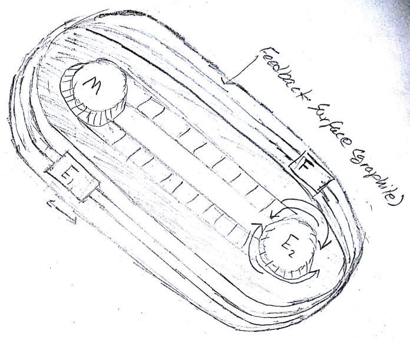

   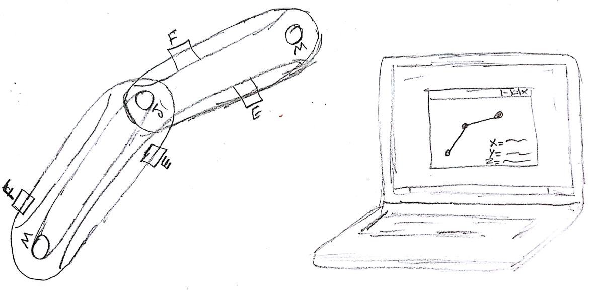

Each anyAxes joint consists of motor connected to one rotating actuator which in turns connected to a rotating end effector via a timing belt where another liner motion end effector (E) will be connected, on the other hand, a metallic end effector will be connected to the other side of the belt (F), the F end effector is always touch a graphite plate, this plate is used as potentiometer as its resistance is measured between one point and the F end effector using a voltage divider method.

So the end result of the project will be a modular joints that can be connected in different ways, with live feedback, so the user will able to see the position of the end point effector live on his computer as I am planning to display these joints feedback readings using software GUI interface such as python or processing with forward and invers kinematics so the user does not need to worry about such complex programming and start designing machines on the go.

The idea of using pencil graphite with a timing belt is to simulate the function of linear potentiometer and I will try to make all the parts from what I will learn during fabacademy.  

### **Update: Changing Project**.

 Due to the fact that my project was depending on linear analog feedback which is graphite, Fransisco suggested that analog is not reliable and I found that I can not shape graphite easily as it can not be molded, it is actually used as mold frequently, so I decided to drop this idea for now but I might do it after fabacademy. My Final Project changed to **FAB-ROVER.**

**FAB-ROVER: Introduction**
---------------------------

**FAB-ROVER**
====================
Fab Rover is a Mars rover that is based on Rocker Bogie suspension system and meant to work in desert to collect scientific measurements. I want to make an open rover platform that can be customized easily and can be fabricated totally in the FabLab. The below images shows my first drafts of the design using Fusion360 software.

   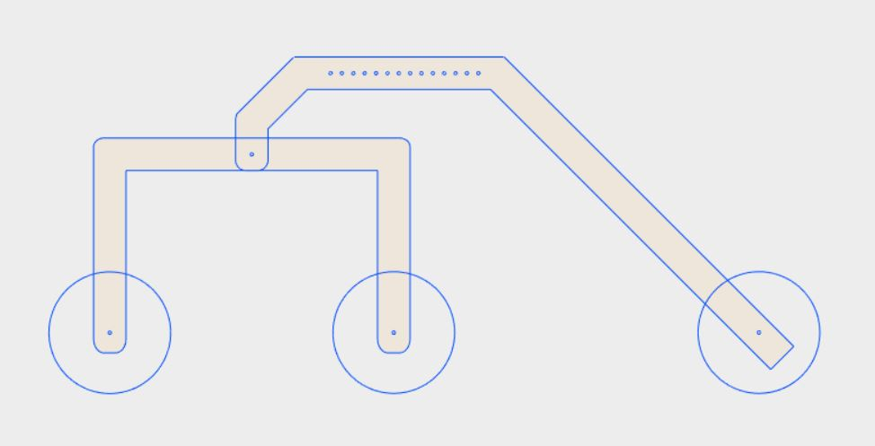

   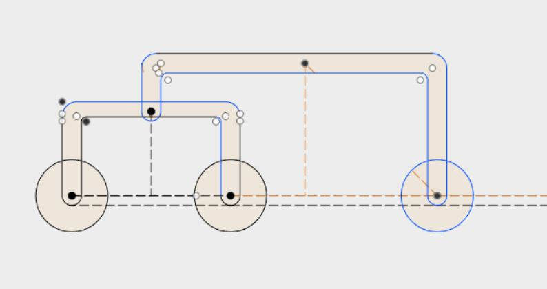

The project will have a rocker bogie suspension system which is a suspension system that does not require springs at all and is used by NASA in their rovers. It consists of two main linkage which are the rocker and the bogie. The rocker is the longest linkage and directly connected to the body of the rover via a rotation joint. The other linkage is called the bogie and it consists of the two wheels and is linked to the rocker with rotation joint as well. The body is kept from moving via differential system.

FabRover is meant to be an open source project that can be fabricated in the FabLab. Thus I tried to fabricate as much as I can using digital fabrication techniques. The frame of the rover is made using 12 mm laser cut acrylic while the wheels are made using 3D Printing. The electronics are based on attiny44 and are I2C and RS32 serial ready.

### **Wheels: 3D Design and 3D Printing**

I was planning to make the wheels by 3D printing the rims and molding the tire treads into each rim. Below is the final design of the rim:

<iframe width="640" height="480" src="https://sketchfab.com/models/5fc6887b644b4783913db2bbdfb1105e/embed" frameborder="0" allowvr allowfullscreen mozallowfullscreen="true" webkitallowfullscreen="true" onmousewheel=""></iframe>

<a href="https://sketchfab.com/models/5fc6887b644b4783913db2bbdfb1105e?utm_medium=embed&utm_source=website&utm_campain=share-popup" target="_blank" style="font-weight: bold; color: #1CAAD9;">Wheel Design6</a>
by <a href="https://sketchfab.com/HashimNabil?utm_medium=embed&utm_source=website&utm_campain=share-popup" target="_blank" style="font-weight: bold; color: #1CAAD9;">HashimNabil</a>
on <a href="https://sketchfab.com?utm_medium=embed&utm_source=website&utm_campain=share-popup" target="_blank" style="font-weight: bold; color: #1CAAD9;">Sketchfab</a>

Then due to time limit as I changed my final project in almost the last two weeks of Fabacademy, I dropped the idea of molding and casting the wheels. So I just used the 3D printed rims as wheels as shown below:

   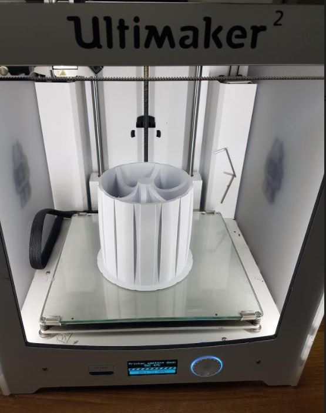

### **Frame and Motors Mount: 2D Design & Laser Cutting**

After designing the wheel I designed the Frame using Topology Optimization feature in Fusion 360. I started by designing simple frame and I cut it with card boar as shown below:

   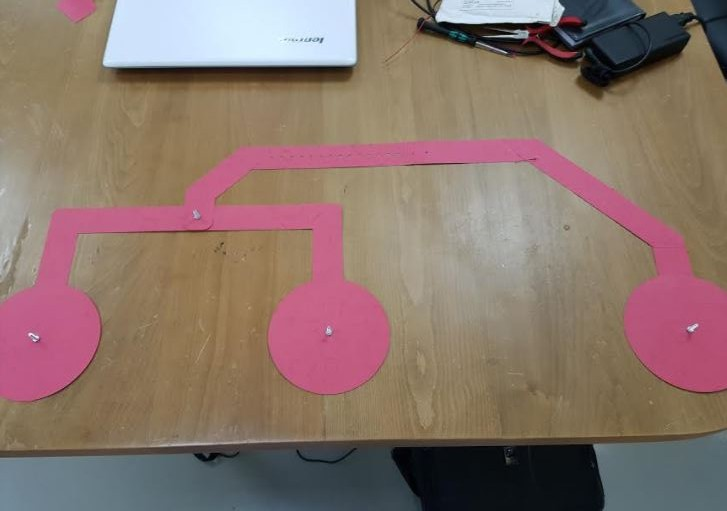

The idea was to determine the final dimensions of the frame. After modifying the frame dimensions and shape, I used Topology optimization of Fusion 360 software to decrease the weight of the design and
The below images shows the design of the rocker and bogie joints after applying the topology optimization to them.

   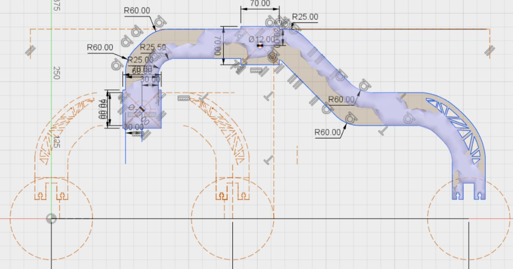

   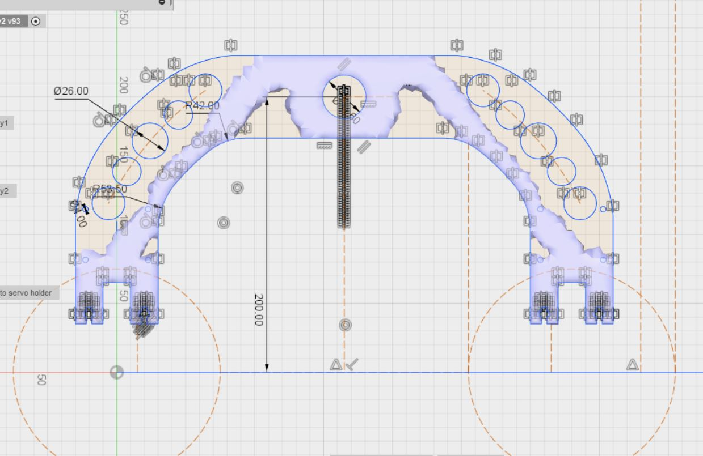

Then I laser the with 12 MM acrylic with the below settings:

   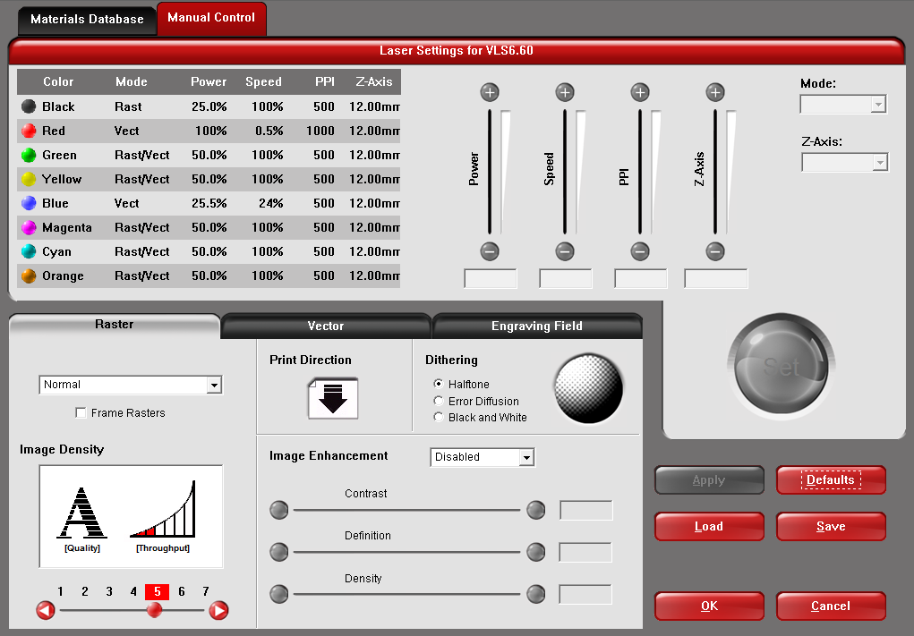

I also designed a laser cut motors mount as shown below:

   

  

   

  

Then we assembled it to the frame as shown below:

   

We used 8 16 mm M3 screws and nuts to assemble the laser acrylic mount of the DC motor and then 3 10 mm M3 screws to mount the dc motor to the mounting case:

   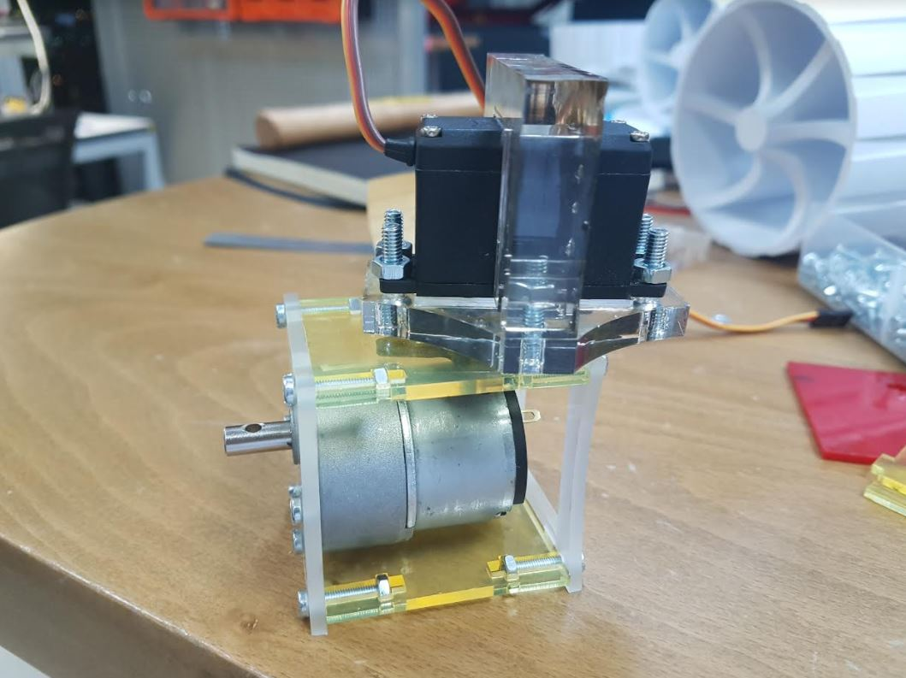

   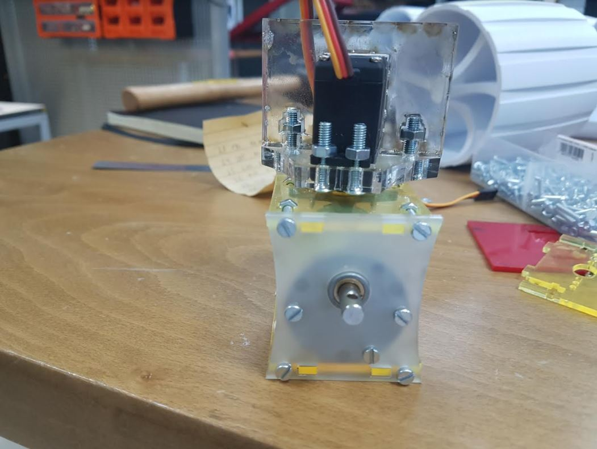

### ***Differential Design: 3D Design and 3D Printing, Mechanical Design***

I used Autodesk Inventor to design the bevel gears of FabRover differential as the assembly mode of Autotdesk Inventor has a design tool for bevel gears.

   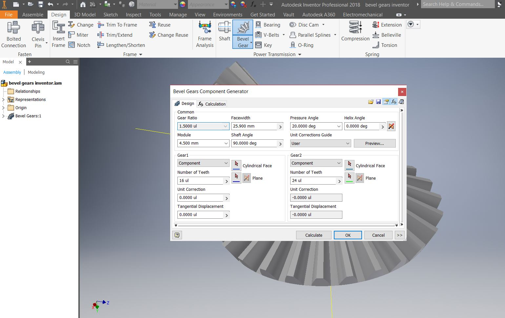

  

<iframe width="640" height="480" src="https://sketchfab.com/models/523d4e1ab2c34487a2134aa7161870cc/embed" frameborder="0" allowvr allowfullscreen mozallowfullscreen="true" webkitallowfullscreen="true" onmousewheel=""></iframe>

<a href="https://sketchfab.com/models/523d4e1ab2c34487a2134aa7161870cc?utm_medium=embed&utm_source=website&utm_campain=share-popup" target="_blank" style="font-weight: bold; color: #1CAAD9;">Bevel Gears Inventor</a>
by <a href="https://sketchfab.com/HashimNabil?utm_medium=embed&utm_source=website&utm_campain=share-popup" target="_blank" style="font-weight: bold; color: #1CAAD9;">HashimNabil</a>
on <a href="https://sketchfab.com?utm_medium=embed&utm_source=website&utm_campain=share-popup" target="_blank" style="font-weight: bold; color: #1CAAD9;">Sketchfab</a>

Then I printed them using Ultimaker 2 3D printer. I used 12 mm thread to mount the side gears while I mounted the main bevel gears to the body of the rover using a 12 mm screw and a bearing. The below image shows the differential system of FAB-ROVER:

   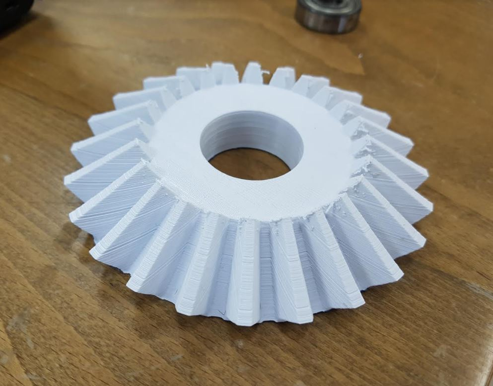

The below video shows the differential system being tested:

<iframe width="560" height="315" src="https://www.youtube.com/embed/AWKjvehH8KM" frameborder="0" allowfullscreen></iframe>

### **Main control boards: Electronic Design and fabrication, CNC Milling**

I made 3 types of boards. The main board that has a bluetooth connection, serial connection and I2C connection. Below is the images of the main board:

   

The second board is the motors board or what I call the nodes. Each nodes can control a DC motor and servo motor using hardware PWM channels of the attiny44.

   

The documentation of the motors node board can be found at [week 10](http://archive.fabacademy.org/archives/2017/fablabuae/students/154/week10/week10.html)  while the documentation of the interface and networking of the boards can be found at
[week16](http://archive.fabacademy.org/archives/2017/fablabuae/students/154/week16/week16.html).

The third board is the input board which has an lDR and more can be found at my input devices [week](http://archive.fabacademy.org/archives/2017/fablabuae/students/154/week13/week13.html).

   

### ***First iteration***

I would like to thank Mr Francisco for helping me out in assembling the first version of FabRover as it was pretty difficult to assemble it by myself. We assembled it on the top of two wooden chairs so we can test the differential system as shown in the below video:

<iframe width="560" height="315" src="https://www.youtube.com/embed/YinD66RtSWY" frameborder="0" allowfullscreen></iframe>

Then we put it in the ground for the first time and we went into hysterical laughing as the wheels were bended so bad and the seen itself was funny given the fact that we took a lot of time assembling the rover and it was just before the presentation day! Well the below picture explains everything:

   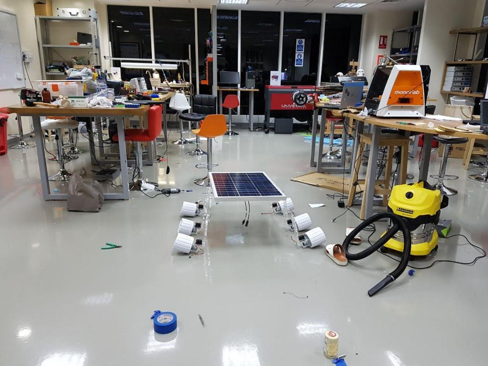

So right at this moment I realized how important is to do multiple iterations of the project instead of wasting a lot of time in the design. After this first iteration I figured out the main reasons of this significant bending of the wheels which are:

- The rocker joint were connected to the differential system using bearing which is a design mistake I made as the rocker and bogie joints should be fixed to the thread of the differential system.

### ***Final Version***

The below images shows the final version of the project.

   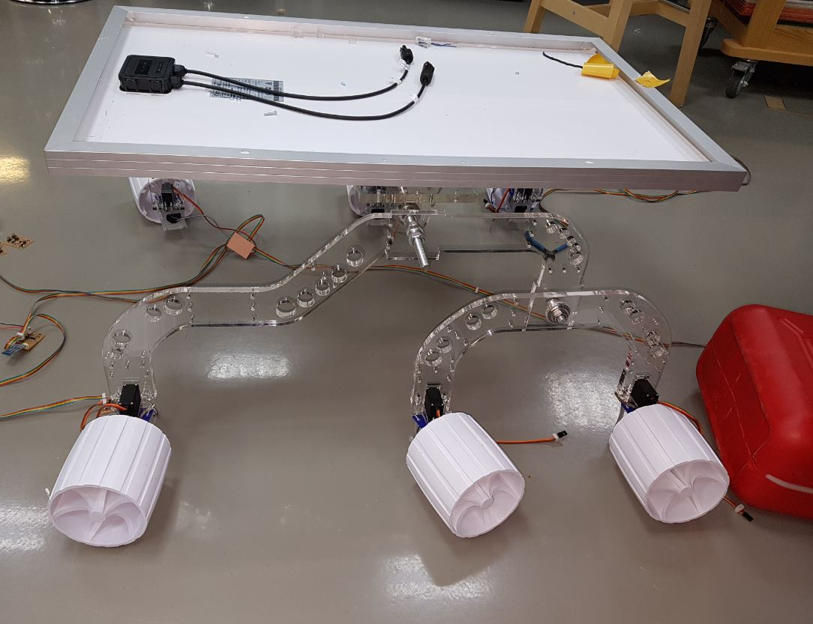

   

### ***FabRover Mobile App***

I designed a simple android application and the documentation can be seen in [week 16]. Below a screenshot of the app:

   

.

### ***Conclusion***

I managed to finish the output (week 10), input (week13) and part of the app (week16). In the second iteration of the mechanical design the managed to reduce the bending significantly and I will eliminate it after fabacademy as I learned many things from iterative design. I did not manage to make the system fully work right now due to the time limit and due to the many problems I faced.

I learned a lot from this project and the most important things I learned was itaritive design.

### ***Final Project Files***

- [Final Project Files](fabrover.tar.gz)
- [Slide](http://archive.fabacademy.org/archives/2017/fablabuae/students/154/presentation.png)
- [Video](http://archive.fabacademy.org/archives/2017/fablabuae/students/154/presentation.mp4)
- [FabRover Fusion360 Files (wheel, differential, frame, motors mounts)](FabRover-Hashim.f3d)
- [rocker-dxf](rocker.dxf)
- [bogie-dxf](bogie.dxf)
- [servo mount -dxf](servo.dxf)
- [dc motor mount](dc.dxf)

 Fab Rover by Hashim Al Sakkaf is licensed under a <a rel="license" href="http://creativecommons.org/licenses/by-nc/4.0/">Creative Commons Attribution-NonCommercial 4.0 International License</a>.
